<h2>What is E-Talk?</h2>

    E-Talk is a social media application that allows individuals in the tech industry
    to connect with each other.

    Technology is always changing and advancing, and there has been an increase in demand
    for technical skills, but the demand is not the only thing that has increased. I noticed
    a lot more people have become interested in working in tech compared to a few years ago.

    With a lot of resources online, learning technical skills have become easier than before, but 
    it has come to my attention that it might not always be easy to find an environment where they
    can apply these hard earned skills. 

    E-Talk allows users to connect with others in the tech industry with similar goals and interests.
    This can lead to potential employment opportunities, mentors to receive advice from, or even 
    a partner to work on side projects and prepare for technical interviews.

<h2>
    Screenshots
</h2>

    
Authentication

     
    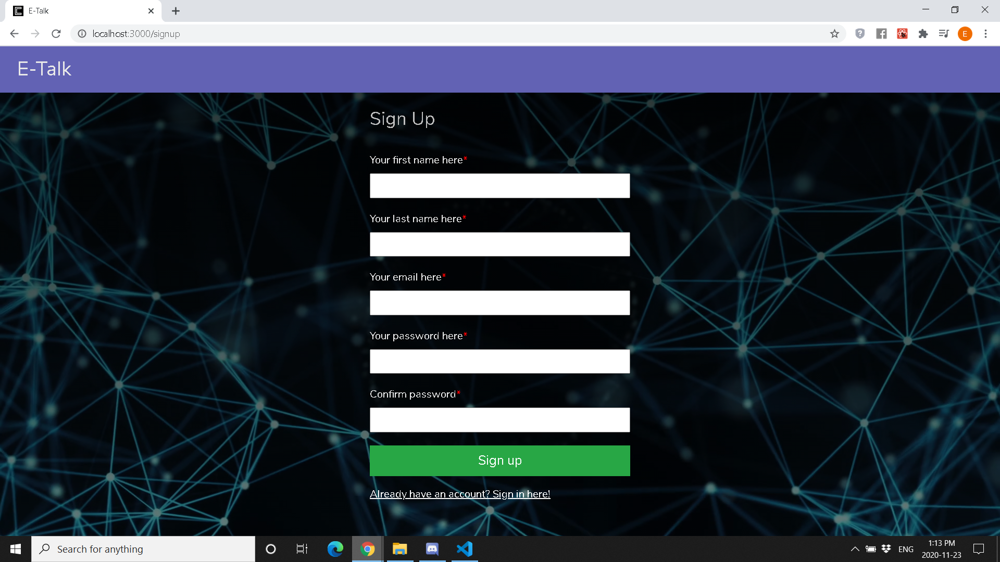

    
Profile

    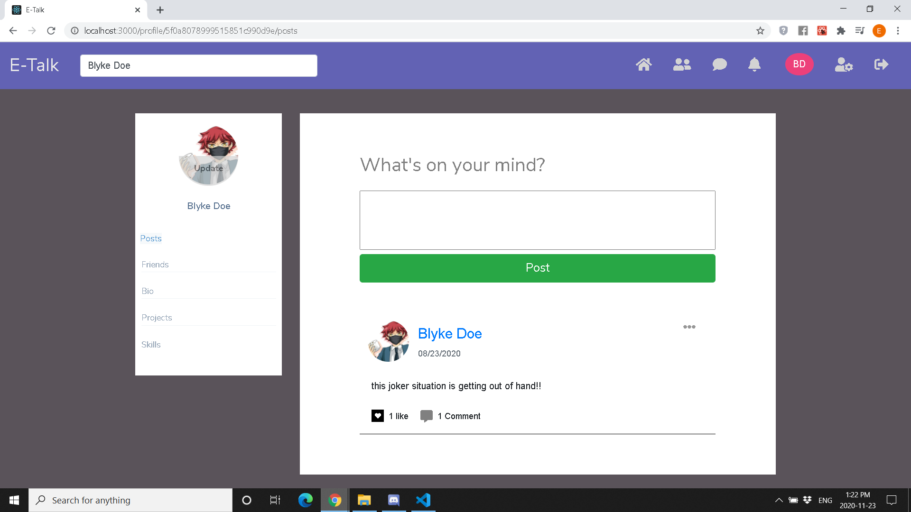 
    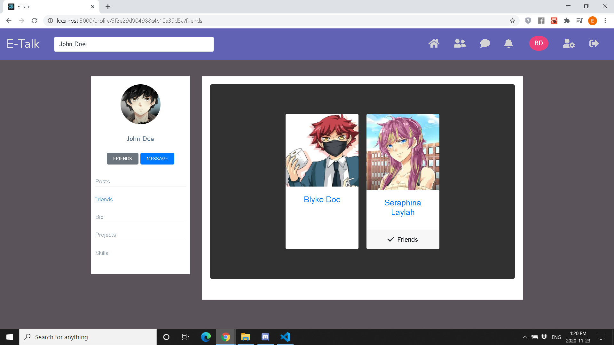
    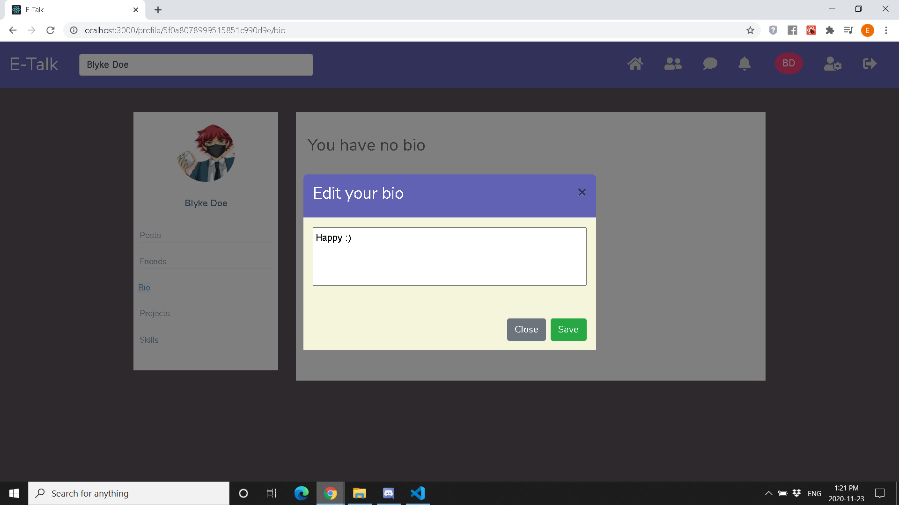
    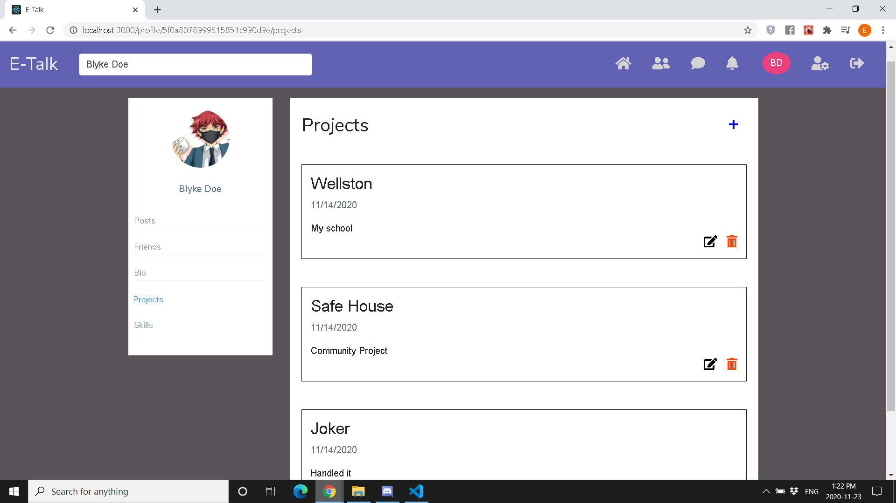 
    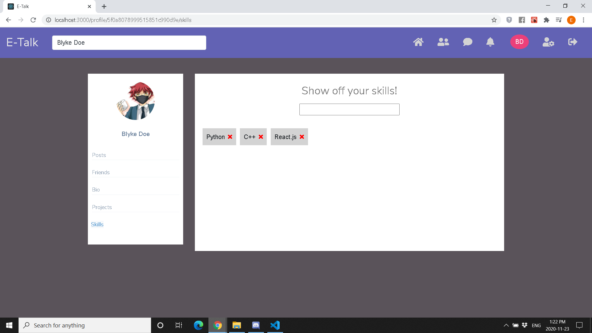

    
Messages and other features

    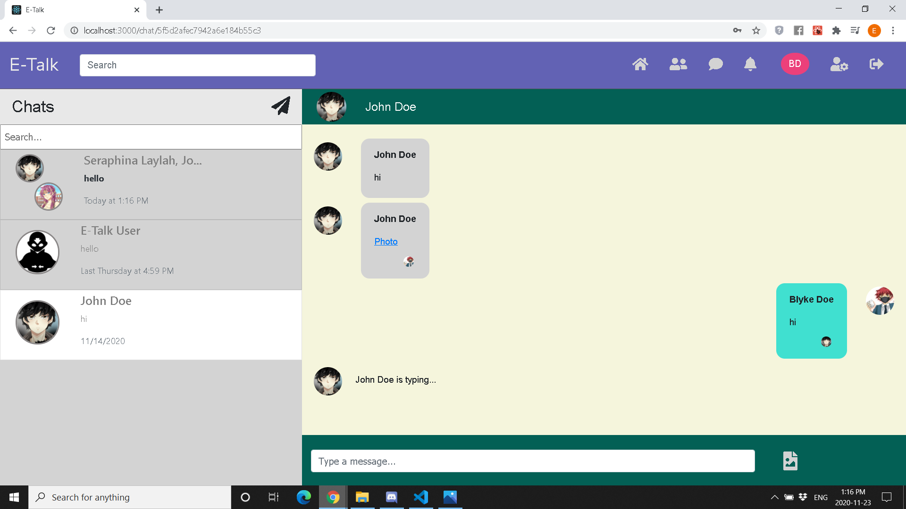 
    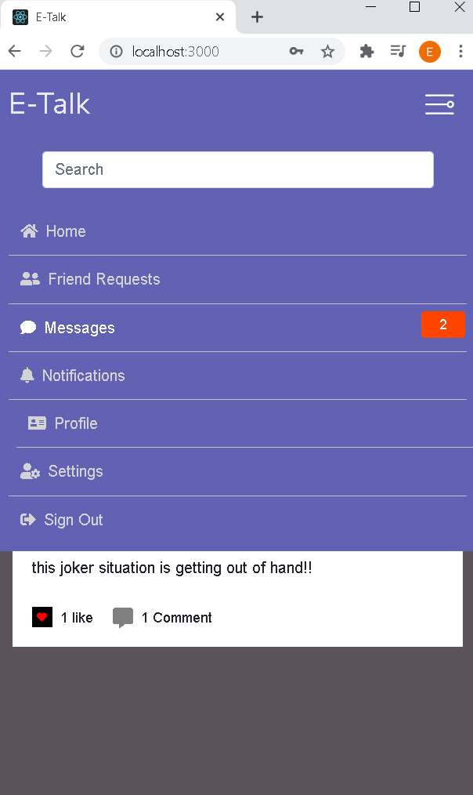
    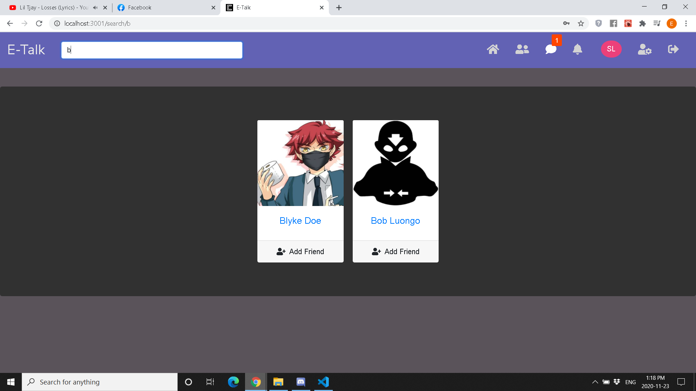 
    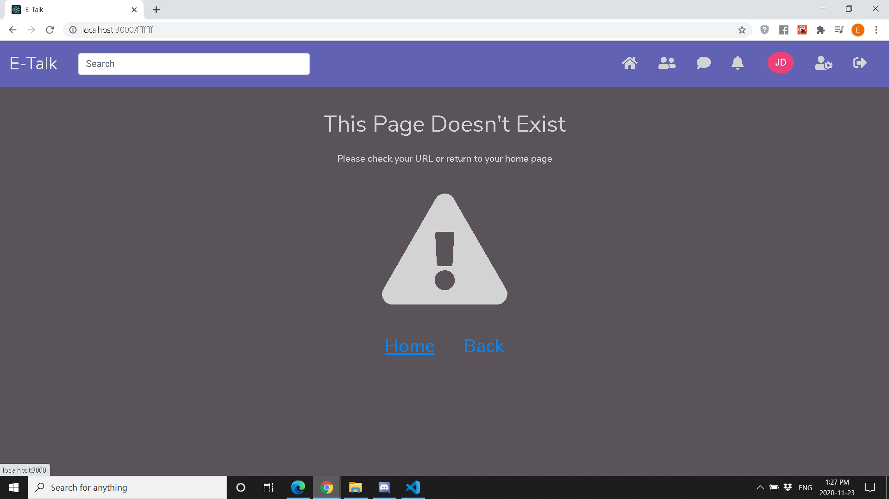
    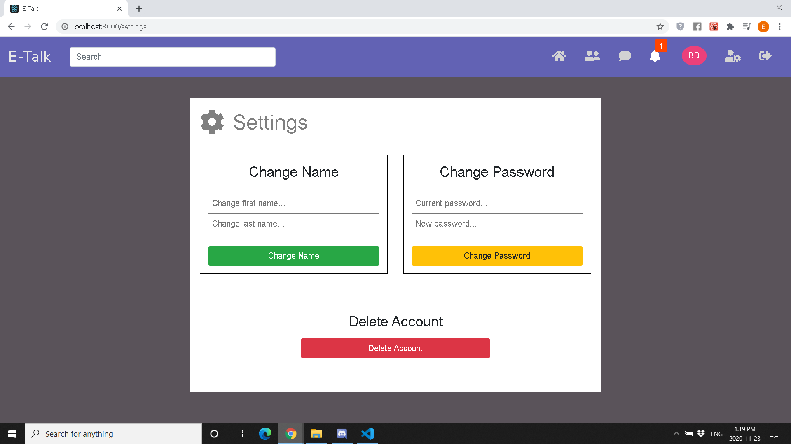 

    
User Posts

    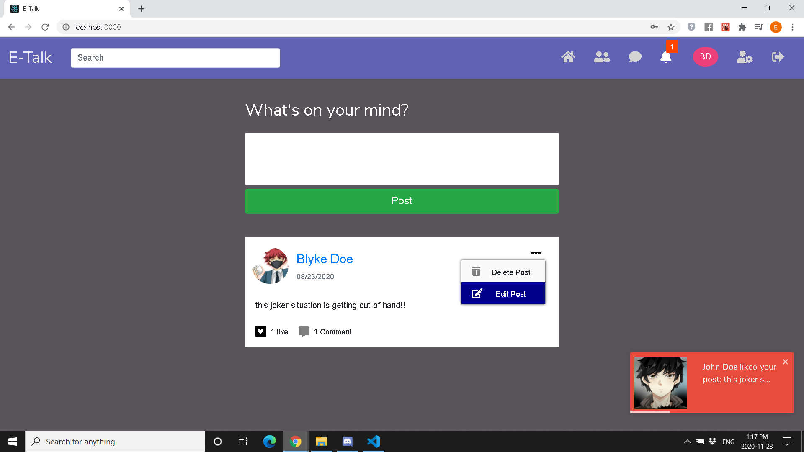 
    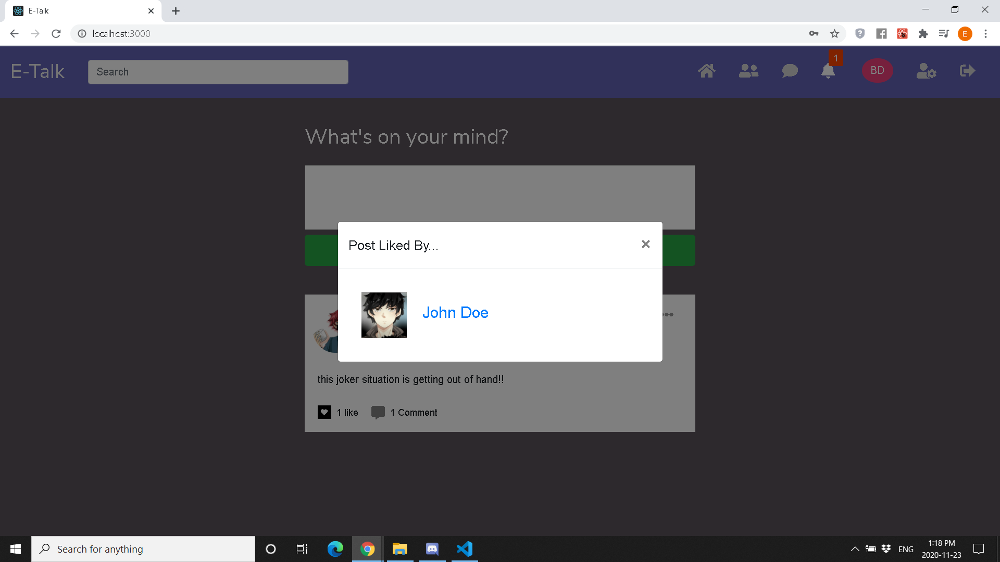
    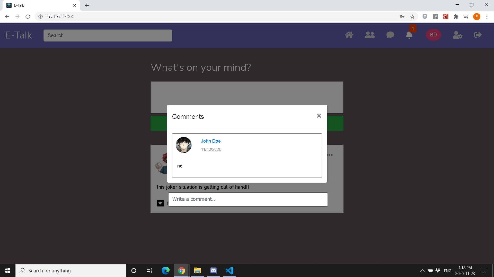 

    
Notifications

    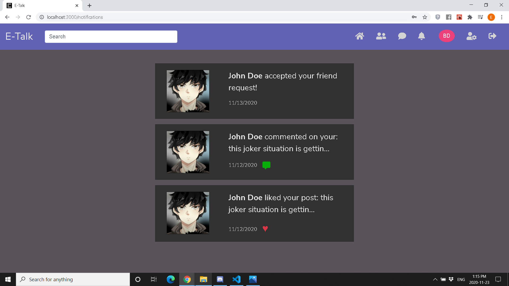 
    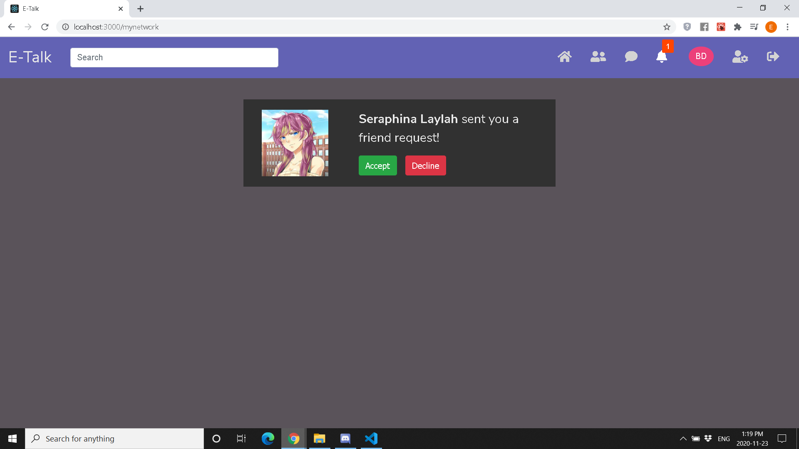

<h2>
    Tech Stack
</h2>

    E-Talk was created using React.js, Redux, Node.js, Express.js, MongoDB, Socket.io and styled using 
    Bootstrap 4.

    React.js was chosen in the frontend to create a page that changes dynamically based on the user's actions,
    such as liking or commenting on a post, while Redux was chosen for better state management. Lastly Boostrap was
    chosen so it was easier to implement features like navbars and modals.

    Node.js was used in the backend to manage third party packages that allows me to a variety of things on the backend
    such as update/load a user's profile picture. Express.js was used because it simplified handling http requests to the
    server. MongoDB was selected as opposed to MySQL (the database for E-Talk 1.0), so we could be more flexible with our data.
    Socket.io, a library that takes advantage of web sockets, was used to handle real time events like notifications, friend 
    requests and messages.

<h2>
    Future
</h2>

    E-Talk is something I definitely want to expand in the future, and am excited to start working on the third iteration.

    Some new features I would consider is to recommend friends, implement a better search algorithm, show friends who are online, 
    expand the users's settings, expand chat settings, allow users to post source code for their projects (instead of just
    a description of them), and implement many more whether that's in the next iteration or future iterations of the application.

    I might considering changing up the tech stack not only for learning experience, but to best fit the needs of the website.
    Instead of using the client side local storage to persist the user data, I want to set up a server side cache
    using Express-Session and Redis. I might also look into changing the architecture of the server from one based on
    REST API to one based on GraphQL. I also want to look into using Next.js instead of React.js for 
    search engine optimization via server side rendering, I am excited to look into new technology. Lastly, I am open 
    to using TypeScript for a better development experience. 

    Working on this application has helped me improve my technical skills, and I hope I can continue to improve!

