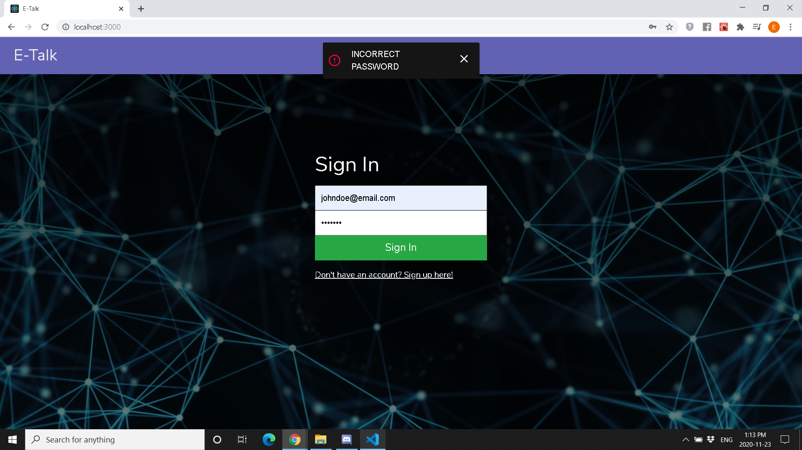

<h2>
    Screenshots
</h2>

    
Authentication

     
    

    
Profile

     
    
    
     
    

    
Messages and other features

     
    
     
    
     

    
User Posts

     
    
     

    
Notifications

     
    

<h2>What is E-Talk?</h2>

    E-Talk is a social media application that allows individuals in the tech industry
    to connect with each other.

    Technology is always changing and advancing. In recent years, the demand for technical skills has increased significantly.
    As a result of this, I noticed a lot more people have become interested in working in tech.

    With a lot of resources online, learning technical skills have become easier than before, but 
    it has come to my attention that it is not always be easy to find an environment where these
    hard earned skills can be applied.

    E-Talk allows users to connect with others in the tech industry with similar goals and interests.
    This can lead to potential employment opportunities, mentors to receive advice from, or even 
    a partner to work on side projects and prepare for technical interviews with.

<h2>
    Tech Stack
</h2>

    E-Talk was created using React.js, Redux, Node.js, Express.js, MongoDB, Socket.io and styled using 
    Bootstrap 4.

    I chose to use React.js in the frontend to create pages that change dynamically based on the user's actions,
    while Redux allows better state management. Lastly, I have chosen to use Bootstrap so that it was easier to 
    implement features like navbars and modals.

    I used Node.js in the backend to manage third party packages that allowed me to do a variety of cool things
    like updating and loading a user's profile picture from the server. Express.js was used because it simplified handling http requests to the
    server. MongoDB was selected as opposed to MySQL (the database for E-Talk 1.0), so I could be more flexible with my data.
    Socket.io, a library that takes advantage of web sockets, was used to handle real time events like notifications, friend 
    requests and messages.

<h2>
    Future
</h2>

    E-Talk is something I definitely want to expand in the future, and I am excited to start working on its third iteration.

    Some new features I would consider are recommending friends, implementing a better search algorithm, showing friends who are online, 
    expanding the user's settings, expanding chat settings, allowing users to post source code for their projects (instead of just
    a description of them), and implementing many more whether that's in the next iteration or future iterations of the application.

    I am considering changing up the tech stack not only for my learning experience, but to best fit the needs of the website.
    Instead of using the client side local storage to persist the user data, I want to set up a server side cache
    using Express-Session and Redis. I might also look into changing the architecture of the server so that it utilizes GraphQL rather than REST API. 
    I also want to look into using Next.js instead of React.js for 
    search engine optimization via server side rendering. Lastly, I am open 
    to using TypeScript for a better development experience. 

    Working on this application has helped me improve my technical skills, and I hope I can continue to improve!

